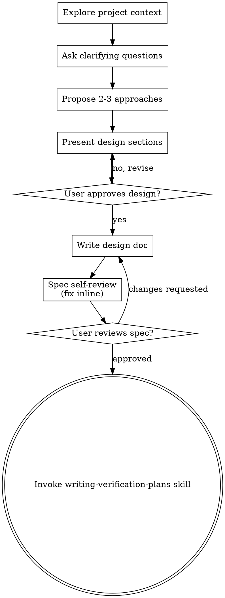

# Brainstorming Ideas Into Designs

Help turn ideas into fully formed designs and specs through natural collaborative dialogue.

Start by understanding the current project context, then ask questions one at a time to refine the idea. Once you understand what you're building, present the design and get user approval.

<HARD-GATE>
Do NOT invoke any implementation skill, write any code, scaffold any project, or take any implementation action until you have presented a design and the user has approved it. This applies to EVERY project regardless of perceived simplicity.
</HARD-GATE>

## Anti-Pattern: "This Is Too Simple To Need A Design"

Every project goes through this process. A todo list, a single-function utility, a config change — all of them. "Simple" projects are where unexamined assumptions cause the most wasted work. The design can be short (a few sentences for truly simple projects), but you MUST present it and get approval.

## Anti-Pattern: Dumping Your Agenda As "Discussion"(光佑 2026-07-10)

S0/brainstorm 討論是**了解你的 human partner 的意圖,不是告訴他你的意圖**。開場先讀懂 ask 與既有 context,問聰明的「領域」澄清題 — 自然對話,不是 meta 問卷、不逐條索取原話。你自己的方案、決策菜單、命名偏好留在肚子裡:material unknowns 歸零之前就端出「我建議的 N 個 decision」讓他挑,是把你的 frame 強加在還沒成形的意圖上 — S0 的頭號反模式。建議仍可附,但只附在幫他回答的澄清題選項上,不以議程形式出現。

## SPG S0_DISCUSS station

When this skill runs as SPG `S0_DISCUSS`, start the session with `spg start`. Exhaustively elicit stakeholder needs, resolve material unknowns, and record the session's needs, unknowns, decisions, clarifications, and issue coverage in `stakeholder-needs.json`, `material-unknowns.json`, `decision-log.md`, `clarification-log.json`, and `issue-coverage.json`; include digests for each emitted artifact. Finish the station with `spg s0-check <run_dir>`.

On re-entry, append only to `clarification-log.json` and `decision-log.md`; token-bound artifacts must not be mutated. Maintain exactly one cumulative handoff per run/session: place it under the run's `handoffs/`, use a filename containing the session name and creation date, and update that same document at each completed station. The handoff is ignored with the run and records the current station, next three stations, outputs/digests, remaining work, and takeover instructions.

## Checklist

Before asking ANY question: read the relevant files/configs/commits first. Never spend a question on a fact you can obtain yourself (investigate-before-ask).

Before you may "Propose approaches" you MUST pass a context-completeness check: explicitly list the remaining MATERIAL unknowns about intent / constraints / context. If that list is non-empty, keep asking — there is NO fixed question count (three is not a target). The bar is ZERO material unknowns before you propose.

You MUST create a task for each of these items and complete them in order. The flow is a **TWO-PASS LOOP**: draft → SOTA research → refine → final. Single-pass (skip SOTA between draft and final) is forbidden — known failure mode: missing higher-level solutions that prior art already solved.

**PASS 1 — discovery & draft:**

1. **Explore project context** — check files, docs, recent commits
2. **Offer the visual companion just-in-time** — NOT upfront. The first time a question would genuinely be clearer shown than described, offer it then (its own message); on approval its browser tab opens for you. If no visual question ever arises, never offer it. See the Visual Companion section below.
3. **Ask clarifying questions exhaustively** — one at a time. Bar is ZERO material unknowns about intent / constraints / context. Keep going until exhausted; three questions is not a target.
4. **Propose 2-3 approaches** — with trade-offs and your recommendation
4a. **SYS.1 stakeholder elicitation (HARD GATE — required BEFORE the Spec Draft).** Exhaustive stakeholder elicitation is not optional and not a summary. Emit three durable elicitation artifacts and they must pass before you may write step 5:
    - `stakeholder-needs.json` — one row per elicited need: `{need_id, stakeholder, need, acceptance_signal}`. Elicitation must be EXHAUSTIVE across stakeholders/roles (not just the requester).
    - `material-unknowns.json` — `[{id, question, status}]`; **ZERO unresolved material unknowns** are allowed before the Spec Draft (status must be `resolved` for every entry, or the gate blocks).
    - `decision-log.md` — every material decision + its rationale, append-only.
    Every `need_id` in `stakeholder-needs.json` MUST trace forward to a Capability Registry Cap-ID (`need_ids` on the cap) — an elicited need with no Cap-ID is a silently-dropped need and blocks. The deterministic gate is `lib/runtime/payload/sys1_elicitation.py:validate(...)`; it must return `ok:true` before step 5. (This is the upstream analogue of the prose↔registry / coverage gates: an explicit, acknowledged, traceable record — never "I think I understand".)
5. **Write spec DRAFT** — to `docs/superpowers/specs/YYYY-MM-DD-<topic>-design.md` (clearly labelled "Status: DRAFT"). Include the Required spec sections (Capability Registry, ## Surfaces, placeholder Prior-art section). Each capability carries the `need_ids` it satisfies (Need→Cap traceability).
6. **Expected mock v1** — after Spec Draft, produce the expected mock artifact so the user can review the rough shape before SOTA might reshape it. UI specs use a non-interactive web page; non-UI specs use a PNG, diagram, CLI transcript mock, API payload mock, or equivalent artifact.

**PASS 2 — SOTA falsification & refine (mandatory; do NOT collapse into pass 1):**

7. **SOTA research** — for each significant approach/abstraction in the draft, WebSearch for prior art, named methods, and SOTA techniques. Per finding, write a verdict: adopt / adapt / reject + one-line reason + citation. Surface to the user any finding that genuinely reshapes the design (don't just append a section — bring it back to the conversation).
8. **Second-pass brainstorming with the user** — fold SOTA findings back into the conversation. Ask exhaustively again until ZERO material unknowns about the revised direction (skipping this step is the known forgetting failure mode — SOTA must inform design, not decorate it).
9. **Spec FINAL** — update the spec to "Status: FINAL"; populate the Prior-art / SOTA + verdicts section with the research results.
10. **Expected mock v2** — after Spec Final, regenerate the expected mock artifact if the design materially changed in pass 2. UI specs use a non-interactive web page; non-UI specs use a PNG, diagram, CLI transcript mock, API payload mock, or equivalent artifact.
11. **Spec self-review** — quick inline check for placeholders, contradictions, ambiguity, scope (see below)
12. **User reviews written spec** — ask user to review the spec file before proceeding
13. **Transition to verification design** — invoke `writing-verification-plans` to create `.superpowers/verify/test-design.json`; only after that is approved may `writing-plans` create the implementation plan.

## Process Flow



**The terminal state is invoking `writing-verification-plans`.** Do NOT invoke frontend-design, mcp-builder, writing-plans, or any implementation skill before the verification plan exists and is approved. Placement decisions (which capability lives on which surface) are locked down in the spec's Capability Registry — see "Required spec sections" below; no separate architecture skill is invoked.

## The Process

**Understanding the idea:**

- Check out the current project state first (files, docs, recent commits)
- Before asking detailed questions, assess scope: if the request describes multiple independent subsystems (e.g., "build a platform with chat, file storage, billing, and analytics"), flag this immediately. Don't spend questions refining details of a project that needs to be decomposed first.
- If the project is too large for a single spec, help the user decompose into sub-projects: what are the independent pieces, how do they relate, what order should they be built? Then brainstorm the first sub-project through the normal design flow. Each sub-project gets its own spec → plan → implementation cycle.
- For appropriately-scoped projects, ask questions one at a time to refine the idea
- Prefer multiple choice questions when possible, but open-ended is fine too
- Only one question per message - if a topic needs more exploration, break it into multiple questions
- Focus on understanding: purpose, constraints, success criteria

**Exploring approaches:**

- Propose 2-3 different approaches with trade-offs
- Present options conversationally with your recommendation and reasoning
- Lead with your recommended option and explain why

**Presenting the design:**

- Once you believe you understand what you're building, present the design
- Scale each section to its complexity: a few sentences if straightforward, up to 200-300 words if nuanced
- Ask after each section whether it looks right so far
- Cover: architecture, components, data flow, error handling, testing
- Be ready to go back and clarify if something doesn't make sense

**Design for isolation and clarity:**

- Break the system into smaller units that each have one clear purpose, communicate through well-defined interfaces, and can be understood and tested independently
- For each unit, you should be able to answer: what does it do, how do you use it, and what does it depend on?
- Can someone understand what a unit does without reading its internals? Can you change the internals without breaking consumers? If not, the boundaries need work.
- Smaller, well-bounded units are also easier for you to work with - you reason better about code you can hold in context at once, and your edits are more reliable when files are focused. When a file grows large, that's often a signal that it's doing too much.

**Working in existing codebases:**

- Explore the current structure before proposing changes. Follow existing patterns.
- Where existing code has problems that affect the work (e.g., a file that's grown too large, unclear boundaries, tangled responsibilities), include targeted improvements as part of the design - the way a good developer improves code they're working in.
- Don't propose unrelated refactoring. Stay focused on what serves the current goal.

## After the Design

**Documentation:**

- Write the validated design (spec) to `docs/superpowers/specs/YYYY-MM-DD-<topic>-design.md`
  - (User preferences for spec location override this default)
- Use elements-of-style:writing-clearly-and-concisely skill if available
- Commit the design document to git

**Spec Self-Review:**
After writing the spec document, look at it with fresh eyes:

1. **Placeholder scan:** Any "TBD", "TODO", incomplete sections, or vague requirements? Fix them.
2. **Internal consistency:** Do any sections contradict each other? Does the architecture match the feature descriptions?
3. **Scope check:** Is this focused enough for a single implementation plan, or does it need decomposition?
4. **Ambiguity check:** Could any requirement be interpreted two different ways? If so, pick one and make it explicit.

Fix any issues inline. No need to re-review — just fix and move on.

**User Review Gate:**
After the spec review loop passes, render the written spec into a clickable HTML review page, then ask the user to review that page before proceeding. A raw Markdown path alone is not valid human-review evidence.

The review response MUST include:

- Spec source path: `<path>.md`
- Rendered review page: clickable HTML path/URL
- Expected mock page/artifact: clickable path/URL

> "Spec written and committed to `<path>`. Rendered review page: `<url-or-html-path>`. Expected mock: `<url-or-html-path>`. Please review it and let me know if you want to make any changes before we start writing out the verification plan."

Wait for the user's response. If they request changes, make them and re-run the spec review loop. Only proceed once the user approves.

**Verification design handoff:**

- Invoke `writing-verification-plans` to create `.superpowers/verify/test-design.json`.
- Do NOT invoke `writing-plans` until the verification plan exists and is approved.
- Do NOT invoke unrelated implementation skills (frontend-design, mcp-builder, etc.).

## Key Principles

- **One question at a time** - Don't overwhelm with multiple questions
- **Multiple choice preferred** - Easier to answer than open-ended when possible
- **YAGNI ruthlessly** - Remove unnecessary features from all designs
- **Explore alternatives** - Always propose 2-3 approaches before settling
- **Incremental validation** - Present design, get approval before moving on
- **Be flexible** - Go back and clarify when something doesn't make sense

## Visual Companion

A browser-based companion for showing mockups, diagrams, and visual options during brainstorming. Available as a tool — not a mode. Accepting the companion means it's available for questions that benefit from visual treatment; it does NOT mean every question goes through the browser.

**Offering the companion (just-in-time):** Do NOT offer it upfront. Wait until a question would genuinely be clearer shown than told — a real mockup / layout / diagram question, not merely a UI *topic*. The first time that happens, offer it then, as its own message:
> "This next part might be easier if I show you — I can put together mockups, diagrams, and comparisons in a browser tab as we go. It's still new and can be token-intensive. Want me to? I'll open it for you."

**This offer MUST be its own message.** Only the offer — no clarifying question, summary, or other content. Wait for the user's response. If they accept, start the server with `--open` so their browser opens to the first screen automatically. If they decline, continue text-only and don't offer again unless they raise it.

**Per-question decision:** Even after the user accepts, decide FOR EACH QUESTION whether to use the browser or the terminal. The test: **would the user understand this better by seeing it than reading it?**

- **Use the browser** for content that IS visual — mockups, wireframes, layout comparisons, architecture diagrams, side-by-side visual designs
- **Use the terminal** for content that is text — requirements questions, conceptual choices, tradeoff lists, A/B/C/D text options, scope decisions

A question about a UI topic is not automatically a visual question. "What does personality mean in this context?" is a conceptual question — use the terminal. "Which wizard layout works better?" is a visual question — use the browser.

If they agree to the companion, read the detailed guide before proceeding:
`skills/brainstorming/visual-companion.md`

## Required spec sections (V-model)

Every spec you write MUST include, as first-class sections:

1. **Capability Registry** — one row per designed capability: `Cap-ID | capability (user outcome) | entry_point | entry_type (UI/CLI/API/library) | reachable_path | acceptance_example`. This is the deterministic referent the right-arm verify-arch / verify-spec check the assembled product against.
2. **`## Surfaces`** — one row per user-reachable entry point: `- <name>: <UI|CLI|API|library> — <description>`. The Capability Registry's `entry_point` per Cap-ID must reference one of these Surfaces; that pairing IS the placement decision (no separate architecture phase is needed — the Registry encodes it). A capability named in prose but absent from the Registry/Surfaces is a defect (prose↔registry lint). For a redesign, declare `supersedes: <path-to-prior-spec>` so baseline reconciliation flags silently-dropped capabilities.
3. **Prior art / alternatives considered + verdicts** — SOTA falsification: each finding gets adopt / adapt / reject + a one-line reason and a citation. Authored after intent is clear, before the spec is final.

When you build the Capability Registry (section 1 above), author it with the **capability discovery + scaffold** step below so it passes `spec_quality_audit` by construction.

## Capability discovery + scaffold (author the registry to pass spec_quality_audit by construction)

The Capability Registry above is the DETECT referent; this is the GENERATE half — it asks the author the right questions up front and scaffolds the registry fields, so the emitted registry passes `spec_quality_audit` by construction instead of getting bounced later. It **ASKS for human intent and MUST NOT invent answers** — empty slots are filled by the author, never guessed. Run it BEFORE finalising the Capability Registry, in two ordered sub-steps.

**1. Discover — find capabilities before scaffolding them.** Use the `capability_discovery` library so a capability is not silently missed:

```
py -3 -c "import os,sys; sys.path.insert(0, os.path.expanduser('~/.claude/lib')); import spec_capability_discovery as d; print(chr(10).join(q['dimension']+': '+q['question'] for q in d.discovery_questions()))"
```
(Runs in PowerShell — the primary shell here — and in Bash: only single-quotes appear inside the double-quoted `-c` argument, so neither shell mis-parses it.)

Ask the author each question (dimensions: surface, user_role, data_mutation, lifecycle, failure, deployment). For every candidate capability record an accept/reject DECISION — a rejected candidate MUST carry a `reason` (a dropped capability stays visible). Then build and write the durable record **next to the spec** as `capability-discovery.json`:

```
from spec_capability_discovery import build_discovery_record, unlinked_accepted
rec = build_discovery_record(
    answers=[...],
    decisions=[{"cap_id": "CAP-01", "accepted": True},
               {"cap_id": "CAP-02", "accepted": False, "reason": "out of scope for v1"}],
    registry_links=[{"cap_id": "CAP-01", "registry_entry": "CAP-01"}])
# json.dump(rec, open(".../capability-discovery.json","w"))   # auditable artifact, NOT chat memory
# unlinked_accepted(rec) must be empty once the registry block is emitted (every accepted cap traced)
```

**2. Scaffold — fill the registry by construction.** Once accepted capabilities + their `type_tags` are identified, call `scaffold(capabilities)`:

```
from spec_scaffold import scaffold
registry_json, prompt_sheet = scaffold([{"cap_id": "CAP-01", "type_tags": ["editable", "persists"]}])
```

Present BOTH to the author: the VALID `registry.json` skeleton (required fields present-but-empty) AND the separate Markdown prompt sheet (a question per empty slot + the content-quality prompts for observable-oracle / surface / tag↔prose). The author fills every slot — you ASK, you do not invent — and you emit the filled registry as the spec's ` ```registry ` block. Because the scaffold and the audit share ONE source (`spec_required_fields`), a fully-filled registry passes the deterministic PRESENCE audit by construction (content-quality + high-risk independent review still apply).

**Worked example — one cap, `type_tags: [editable, persists]`.** `scaffold([{"cap_id": "CAP-01", "type_tags": ["editable", "persists"]}])` emits a registry entry whose `state_data_contract` has empty `reload` and `invariant` slots, and a prompt sheet asking *"How does the user confirm the change survived (reload)? What must stay unchanged (invariant)?"*. The author fills them — e.g. `reload: "reopen the note shows the edit"`, `invariant: "other fields and frontmatter untouched"` — plus the baseline slots (entry_point/entry_type/reachable_path, acceptance given/when/then, ≥1 failure_mode). The resulting registry block then satisfies the deterministic STRUCTURAL/PRESENCE checks of `spec_quality_audit` by construction. It does NOT by itself guarantee the CONTENT-quality judgements — A2 (the `then` is an observable outcome, not a proxy), A8 (the outcome matches the declared surface), A9 (high-risk prose carries the matching tag) — nor high-risk independent review; those remain residual checks the author must still satisfy. Scaffold guarantees the slots are present, not that what fills them is good.

## Expected mock after spec (every spec)

After Spec Draft and again after Spec Final if SOTA/refinement materially changed the design, produce an expected mock artifact so the user can see or inspect the intended outcome before verification planning. This is required for every spec, not only UI.

For UI surfaces, produce a NON-INTERACTIVE web page mock so the user can SEE the rough shape:

1. Generate: `py -3 ~/.claude/lib/mock_visual.py <spec.md> <outdir>/site --title "<project> (spec mock)"` (reads the Capability Registry; one clickable page per UI entry point).
2. Serve: `bash ~/.claude/lib/serve-tunnel.sh <outdir>/site` — it prints PUBLIC_URL.
3. Give the user the PUBLIC_URL; say it is NON-INTERACTIVE (just the look/layout) — click through the surfaces.

For non-UI specs, produce the closest equivalent expected mock artifact:

- CLI: command transcript mock or terminal screenshot/PNG.
- API: request/response payload mock or sequence diagram.
- Library: public API usage snippet plus expected return/output diagram when helpful.
- Data/migration/background job: before/after table, state diagram, or PNG/diagram.

## Rendered review artifacts (human review)

Any Markdown file intended for the user to review MUST have a rendered HTML review page. The rendered page must be clickable from the response, must link to the expected mock/review artifacts, and must include a `source-sha256` meta tag for the Markdown source. This applies to Spec Draft, Spec Final, decision logs used as review evidence, and any companion checklist shown for approval.

Raw `.md` paths are source evidence, not human-review evidence. If a gate needs user approval, provide both the source path and the rendered page, and treat raw-MD-only review as incomplete.

Store the artifact path/URL in the spec near the Capability Registry. The verification plan must read this artifact as intent evidence, but it must still derive tests from the Registry acceptance examples.

## Issue Coverage Gate (SYS.1 — required before Spec Draft)

When the user raises any issue across the discussion (numbered/bulleted lists, screenshots, review packets, corrections, objections, follow-up clarifications), every issue must be recorded in a durable `issue-coverage.json` before Spec Draft is written. Context memory alone is not valid evidence.

`issue-coverage.json` must include for each issue:
- `issue_id`, `source_turn_id`, `source_text`, `category`, `decision_status`
- Elicitation dimensions: `answer_status`, `background_status`, `need_status`, `intent_status`, `implicit_context_status` — each must be `resolved`, `repo_evidence`, `prior_approved_spec`, or `deferred_with_user_approval`; any `needs_user` blocks the draft
- `question_ids` referenced from `clarification-log.json` (append-only Q&A written before relying on it)
- `cap_id_refs` — every issue traces to a Cap-ID or an explicit rejected/deferred disposition

Any issue with an unresolved dimension or absent from the capability trace blocks Spec Draft.

## Superpower Progress Line

When this skill is used as part of Superpower, every user-facing pause for question/approval/block and every FSM gate/owner transition MUST include:

`Superpower: now=<gate>(<skill>[ @owner]); next=<gate>(<skill>) > ...`

Already-passed gates are omitted. Non-current owners are explicit.

Do not print this line for routine tool calls or ordinary progress updates inside the same gate.
