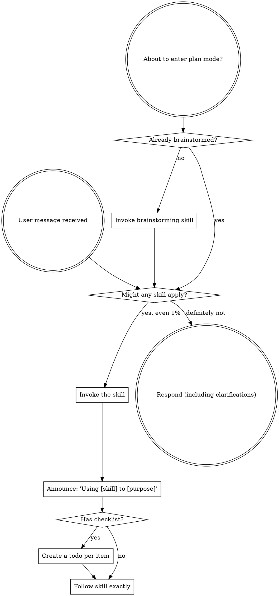

<SUBAGENT-STOP>
If you were dispatched as a subagent to execute a specific task, skip this skill.
</SUBAGENT-STOP>

<EXTREMELY-IMPORTANT>
If you think there is even a 1% chance a skill might apply to what you are doing, you ABSOLUTELY MUST invoke the skill.

IF A SKILL APPLIES TO YOUR TASK, YOU DO NOT HAVE A CHOICE. YOU MUST USE IT.

This is not negotiable. This is not optional. You cannot rationalize your way out of this.
</EXTREMELY-IMPORTANT>

## Instruction Priority

Superpowers skills override default system prompt behavior, but **user instructions always take precedence**:

1. **User's explicit instructions** (CLAUDE.md, GEMINI.md, AGENTS.md, direct requests) — highest priority
2. **Superpowers skills** — override default system behavior where they conflict
3. **Default system prompt** — lowest priority

If CLAUDE.md, GEMINI.md, or AGENTS.md says "don't use TDD" and a skill says "always use TDD," follow the user's instructions. The user is in control.

## How to Access Skills

**Never read skill files manually with file tools** — always use your platform's skill-loading mechanism so the skill is properly activated.

**In Claude Code:** Use the `Skill` tool. When you invoke a skill, its content is loaded and presented to you — follow it directly.

**In Codex:** Skills load natively. Follow the instructions presented when a skill activates.

**In Copilot CLI:** Use the `skill` tool. Skills are auto-discovered from installed plugins.

**In Gemini CLI:** Skills activate via the `activate_skill` tool. Gemini loads skill metadata at session start and activates the full content on demand.

**In other environments:** Check your platform's documentation for how skills are loaded.

## Platform Adaptation

Skills speak in actions ("dispatch a subagent", "create a todo", "read a file") rather than naming any one runtime's tools. For per-platform tool equivalents and instructions-file conventions, see [claude-code-tools.md](references/claude-code-tools.md), [codex-tools.md](references/codex-tools.md), [copilot-tools.md](references/copilot-tools.md), [gemini-tools.md](references/gemini-tools.md), [pi-tools.md](references/pi-tools.md), and [antigravity-tools.md](references/antigravity-tools.md). Gemini CLI users get the tool mapping loaded automatically via GEMINI.md.

## Superpower Entry Comprehension Gate

When the user explicitly says "use superpower", "superpower", "superpower fork", or equivalent, the first substantive response MUST be a natural-language complete stage-order recap. This is a comprehension gate, not a fixed banner.

The response MUST include:

| Stage | Required skill mapping |
|---|---|
| S0_DISCUSS | `superpowers:brainstorming` |
| S1_SPEC_DRAFT | `superpowers:brainstorming` |
| S1_EXPECTED_MOCK_V1 | `superpowers:brainstorming` |
| S1_SOTA | `superpowers:brainstorming` + source research/WebSearch |
| S1_REVISE_DISCUSS | `superpowers:brainstorming` |
| S1_SPEC_FINAL | `superpowers:brainstorming` |
| S1_EXPECTED_MOCK_V2 | `superpowers:brainstorming` |
| S2_VERIFICATION_PLAN | `superpowers:writing-verification-plans` |
| S3_IMPLEMENTATION_PLAN | `superpowers:writing-plans` |
| S4_BUILD | registered engine `superpower-graph (spg)` fleet execution (see Registered Superpower Engine); in-session fallback: `superpowers:executing-plans`, `superpowers:test-driven-development`, or `superpowers:subagent-driven-development` as applicable |
| S5_VERIFY_ARCH | `superpowers:verify-arch`, only for multi-entry projects |
| S5_VERIFY_SPEC | `superpowers:verify-spec` |
| S5_FIX_LOOP | `superpowers:systematic-debugging` plus repeat S4/S5 |
| S6_RELEASE | `superpowers:verification-before-completion` + `superpowers:finishing-a-development-branch` |

The response MUST also state:

- Current state is `S0_DISCUSS`.
- Current action is requirements clarification only.
- Owner is `current session`.
- `S4_BUILD executor` defaults to the registered engine `superpower-graph (spg)` when the task repo is spg-compatible; otherwise `current session`.
- Only `S4_BUILD executor` can become external, and only after explicit confirmation before S4_BUILD.
- If the user specifies a Claude web session for S4_BUILD, the orchestrator MUST use that exact visible Claude Code web session through Chrome control. Do not substitute Claude CLI, a new Claude session, or another existing session. If the named session is absent, busy, or cannot be controlled, stop and report the blocker.

The response MUST NOT:

- Only paste fixed boilerplate.
- Hardcode Codex or Claude as the default owner.
- Ask for an external session before S4_BUILD.
- Treat "Claude Code" or "Claude CLI" as equivalent to a user-specified Claude web session.
- Write a spec, plan, or code before S0_DISCUSS is complete.

## Registered Superpower Engine

`superpower-graph` (spg, `C:\dev\superpower-graph`) is the registered official superpower execution engine (光佑 directive, 2026-07-04; Phase 3 production evidence: 558 tests green, verify-arch 16/16 reachable, verify-spec 16/16 MATCHES).

- Scope today: S1→S4 execution — plan intake, ticket slicing, heterogeneous fleet dispatch per `corpus/model-policy.yaml` (commander=fable, coder=codex, cross-family review), escalation ladder, budget fuse, arbitration, and per-station usage accounting (per-LLM calls + wall minutes + tokens; CAP-44, `spg status --costs/--budgets`).
- `S4_BUILD executor` therefore defaults to the spg fleet (`spg intake` / `spg run` / `spg status`) when the task repo is spg-compatible; `current session` remains the fallback executor.
- S5/S6 stay on the in-session skills listed above until spg Phase 4 delivers verify/release nodes.

# Using Skills

## The Rule

**Invoke relevant or requested skills BEFORE any response or action.** Even a 1% chance a skill might apply means that you should invoke the skill to check. If an invoked skill turns out to be wrong for the situation, you don't need to use it.

## Red Flags

These thoughts mean STOP—you're rationalizing:

| Thought | Reality |
|---------|---------|
| "This is just a simple question" | Questions are tasks. Check for skills. |
| "I need more context first" | Skill check comes BEFORE clarifying questions. |
| "Let me explore the codebase first" | Skills tell you HOW to explore. Check first. |
| "I can check git/files quickly" | Files lack conversation context. Check for skills. |
| "Let me gather information first" | Skills tell you HOW to gather information. |
| "This doesn't need a formal skill" | If a skill exists, use it. |
| "I remember this skill" | Skills evolve. Read current version. |
| "This doesn't count as a task" | Action = task. Check for skills. |
| "The skill is overkill" | Simple things become complex. Use it. |
| "I'll just do this one thing first" | Check BEFORE doing anything. |
| "This feels productive" | Undisciplined action wastes time. Skills prevent this. |
| "I know what that means" | Knowing the concept ≠ using the skill. Invoke it. |

## Skill Priority

When multiple skills could apply, use this order:

1. **Process skills first** (brainstorming, systematic-debugging) - these determine HOW to approach the task
2. **Implementation skills second** (frontend-design, mcp-builder) - these guide execution

"Let's build X" → brainstorming first, then implementation skills.
"Fix this bug" → systematic-debugging first, then domain-specific skills.

## Skill Types

**Rigid** (TDD, systematic-debugging): Follow exactly. Don't adapt away discipline.

**Flexible** (patterns): Adapt principles to context.

The skill itself tells you which.

## Superpower Progress Line

When this skill is used as part of Superpower, every user-facing pause for question/approval/block and every FSM gate/owner transition MUST include:

`Superpower: now=<gate>(<skill>[ @owner]); next=<gate>(<skill>) > ...`

Already-passed gates are omitted. Non-current owners are explicit.

Do not print this line for routine tool calls or ordinary progress updates inside the same gate.

## User Instructions

Instructions say WHAT, not HOW. "Add X" or "Fix Y" doesn't mean skip workflows.
