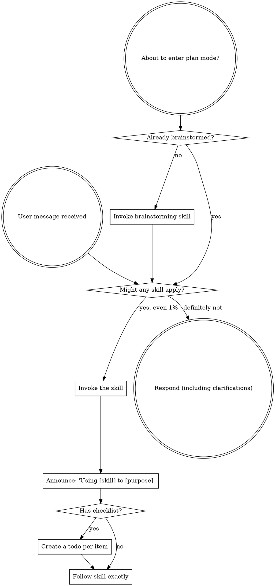

<SUBAGENT-STOP>
If you were dispatched as a subagent to execute a specific task, skip this skill.
</SUBAGENT-STOP>

<EXTREMELY-IMPORTANT>
If you think there is even a 1% chance a skill might apply to what you are doing, you ABSOLUTELY MUST invoke the skill.

IF A SKILL APPLIES TO YOUR TASK, YOU DO NOT HAVE A CHOICE. YOU MUST USE IT.

This is not negotiable. This is not optional. You cannot rationalize your way out of this.
</EXTREMELY-IMPORTANT>

## Instruction Priority

Superpowers skills override default system prompt behavior, but **user instructions always take precedence**:

1. **User's explicit instructions** (CLAUDE.md, GEMINI.md, AGENTS.md, direct requests) — highest priority
2. **Superpowers skills** — override default system behavior where they conflict
3. **Default system prompt** — lowest priority

If CLAUDE.md, GEMINI.md, or AGENTS.md says "don't use TDD" and a skill says "always use TDD," follow the user's instructions. The user is in control.

## How to Access Skills

**Never read skill files manually with file tools** — always use your platform's skill-loading mechanism so the skill is properly activated.

**In Claude Code:** Use the `Skill` tool. When you invoke a skill, its content is loaded and presented to you — follow it directly.

**In Codex:** Skills load natively. Follow the instructions presented when a skill activates.

**In Copilot CLI:** Use the `skill` tool. Skills are auto-discovered from installed plugins.

**In Gemini CLI:** Skills activate via the `activate_skill` tool. Gemini loads skill metadata at session start and activates the full content on demand.

**In other environments:** Check your platform's documentation for how skills are loaded.

## Platform Adaptation

Skills define outcomes, artifacts, gates, and proof without choosing a model, thread, or worker identity. The current host session uses its native tools. Optional collaboration skills run only on an explicit user request. For per-platform tool equivalents and instructions-file conventions, see [claude-code-tools.md](references/claude-code-tools.md), [codex-tools.md](references/codex-tools.md), [copilot-tools.md](references/copilot-tools.md), [gemini-tools.md](references/gemini-tools.md), [pi-tools.md](references/pi-tools.md), and [antigravity-tools.md](references/antigravity-tools.md).

## Superpower Entry Comprehension Gate

When the user explicitly says "use superpower", "superpower", "superpower fork", or equivalent, the first substantive response MUST be a natural-language complete stage-order recap. This is a comprehension gate, not a fixed banner.

The response MUST include:

| Stage | Required skill / authority |
|---|---|
| S0_DISCUSS | `superpowers:brainstorming` — stakeholder needs, material unknowns, issue coverage, decision/clarification logs |
| S0_DRAFT0 | `superpowers:brainstorming` — typed first specification draft |
| S0_MOCK0 | `superpowers:brainstorming` — expected mock / non-UI equivalent |
| S0_SOTA | `superpowers:brainstorming` + source research |
| S0_APPROVE | SPG digest-bound human approval |
| S1_DISCUSS | `superpowers:brainstorming` — fold prior art back into discussion |
| S1_DRAFT1 | `superpowers:brainstorming` — final capability registry and traceability |
| S1_MOCK1 | `superpowers:brainstorming` — final expected mock / non-UI equivalent |
| S1_APPROVE | SPG digest-bound human approval |
| S2_TEST_DESIGN_REVIEW | `superpowers:writing-verification-plans` |
| S3_IMPLEMENTATION_PLAN | `superpowers:writing-plans` |
| S4_BUILD | current host session, host-native implementation and focused TDD |
| S5_VERIFY_ARCH | `superpowers:verify-arch`, only for multi-entry projects |
| S5_VERIFY_SPEC | `superpowers:verify-spec` |
| S5_FIX_LOOP | `superpowers:systematic-debugging` + affected proof pack |
| S6_RELEASE | `superpowers:verification-before-completion` + `superpowers:finishing-a-development-branch` |

The response MUST also state:

- Current state is `S0_DISCUSS`.
- Current action is requirements clarification only.
- SPG receipts and transition contracts are lifecycle authority; chat text is not stage-advance evidence.
- The only human approval gates are `S0_APPROVE` and `S1_APPROVE`.
- Human review evidence is rendered and clickable; a raw Markdown path alone is invalid.
- The current host session owns S2–S6 execution natively. SPG validates evidence but does not choose a model, manufacture a thread, or require an external worker.

The response MUST NOT:

- Only paste fixed boilerplate.
- Hardcode Codex, Claude, a model tier, a thread, or an external worker as the default owner.
- Ask for an external session as part of the lifecycle.
- Write a spec, plan, or code before S0_DISCUSS is complete.

## Registered Superpower Engine

`superpower-graph` (SPG, `C:\dev\skills\superpower-graph`) is the lifecycle and typed
artifact authority. Its production role is S0/S1 discussion/specification handshakes,
the two digest-bound approvals, and mechanical evidence contracts through S2–S6.

Normal execution is host-native: the current host session owns the complete candidate
and may use its native delegation only when it judges a disjoint complete lane useful.
SPG does not select a model, start one runner per station, or require a worker/thread.

## Canonical SPG Invocation

When 光佑 wants Superpower Graph, the user should only need to say one of these:

```text
用 superpower graph 從 S0 開始跑這個 task。
```

```text
Use superpower graph from S0 for this task.
```

Treat that as:

1. Start at `S0_DISCUSS` unless the user supplies a validated SPG run receipt.
2. Use `C:\dev\skills\superpower-graph` as the lifecycle and transition-contract source.
3. Keep S0/S1 in the current host session and submit typed completion payloads to SPG.
4. Continue S2–S6 in the current host session with the canonical quality skills; SPG validates their evidence mechanically.
5. Inspect authority with the focused commands below; do not update or switch the repository implicitly:

```powershell
cd C:\dev\skills\superpower-graph
py -3 -m spg.cli contract lint
py -3 -m spg.cli owner-matrix --md
```

Authoritative runtime path for `spg run` is `spg/cli.py` -> `spg/graph_exec.py` -> `spg/graph.py` plus `spg/nodes/bodies.py` and `spg/transition_contracts.json`.

Do NOT judge current SPG completeness from `spg/runner.py::_ADVANCE`. That table is a legacy/Phase-1 helper and is not the current CLI runtime path.

## SPG Owner Matrix

Do not embed a copied owner matrix in this skill. It becomes stale. Query the live
transition-contract projection with `py -3 -m spg.cli owner-matrix --md`; that output and
the bound ControlStore receipt govern stage ownership and required evidence.

## Rendered Human Review Artifacts

Any Markdown file intended for 光佑 to review MUST also have a rendered, clickable HTML review page. This includes spec draft/final, S2 verification plan summaries, S3 implementation plans, and decision logs when they are review evidence.

- The response to 光佑 must provide the clickable review page link, not only the raw `.md` path.
- The rendered page must include a `source-sha256` meta tag for the source artifact and links to required mock/review artifacts.
- The only human gates are `S0_APPROVE` and `S1_APPROVE`. S2 and S3 are mechanical
  controller gates and must never request or consume a human approval token.
- S0/S1 gates reject raw-MD-only evidence when operator approval is required.

# Using Skills

## The Rule

**Invoke relevant or requested skills BEFORE any response or action.** Even a 1% chance a skill might apply means that you should invoke the skill to check. If an invoked skill turns out to be wrong for the situation, you don't need to use it.



## Red Flags

These thoughts mean STOP—you're rationalizing:

| Thought | Reality |
|---------|---------|
| "This is just a simple question" | Questions are tasks. Check for skills. |
| "I need more context first" | Skill check comes BEFORE clarifying questions. |
| "Let me explore the codebase first" | Skills tell you HOW to explore. Check first. |
| "I can check git/files quickly" | Files lack conversation context. Check for skills. |
| "Let me gather information first" | Skills tell you HOW to gather information. |
| "This doesn't need a formal skill" | If a skill exists, use it. |
| "I remember this skill" | Skills evolve. Read current version. |
| "This doesn't count as a task" | Action = task. Check for skills. |
| "The skill is overkill" | Simple things become complex. Use it. |
| "I'll just do this one thing first" | Check BEFORE doing anything. |
| "This feels productive" | Undisciplined action wastes time. Skills prevent this. |
| "I know what that means" | Knowing the concept ≠ using the skill. Invoke it. |

## Skill Priority

When multiple skills could apply, use this order:

1. **Process skills first** (brainstorming, systematic-debugging) - these determine HOW to approach the task
2. **Implementation skills second** (frontend-design, mcp-builder) - these guide execution

"Let's build X" → brainstorming first, then implementation skills.
"Fix this bug" → systematic-debugging first, then domain-specific skills.

## Skill Types

**Rigid** (TDD, systematic-debugging): Follow exactly. Don't adapt away discipline.

**Flexible** (patterns): Adapt principles to context.

The skill itself tells you which.

## Superpower Progress Line

When this skill is used as part of Superpower, every user-facing pause for question/approval/block and every FSM gate/owner transition MUST include:

`Superpower: now=<gate>(<skill>[ @owner]); next=<gate>(<skill>) > ...`

Already-passed gates are omitted. Non-current owners are explicit.

Do not print this line for routine tool calls or ordinary progress updates inside the same gate.

## User Instructions

Instructions say WHAT, not HOW. "Add X" or "Fix Y" doesn't mean skip workflows.
