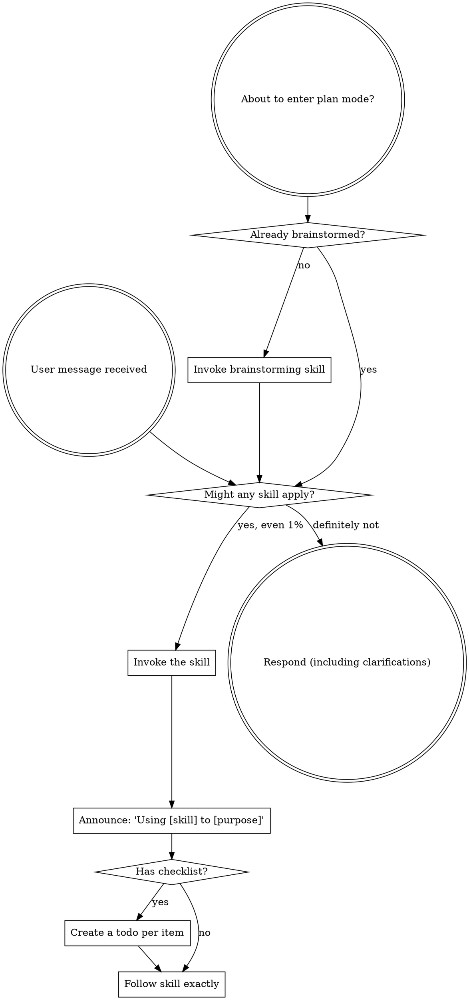

<SUBAGENT-STOP>
If you were dispatched as a subagent to execute a specific task, skip this skill.
</SUBAGENT-STOP>

<EXTREMELY-IMPORTANT>
If you think there is even a 1% chance a skill might apply to what you are doing, you ABSOLUTELY MUST invoke the skill.

IF A SKILL APPLIES TO YOUR TASK, YOU DO NOT HAVE A CHOICE. YOU MUST USE IT.

This is not negotiable. This is not optional. You cannot rationalize your way out of this.
</EXTREMELY-IMPORTANT>

## Instruction Priority

Superpowers skills override default system prompt behavior, but **user instructions always take precedence**:

1. **User's explicit instructions** (CLAUDE.md, GEMINI.md, AGENTS.md, direct requests) — highest priority
2. **Superpowers skills** — override default system behavior where they conflict
3. **Default system prompt** — lowest priority

If CLAUDE.md, GEMINI.md, or AGENTS.md says "don't use TDD" and a skill says "always use TDD," follow the user's instructions. The user is in control.

## How to Access Skills

**Never read skill files manually with file tools** — always use your platform's skill-loading mechanism so the skill is properly activated.

**In Claude Code:** Use the `Skill` tool. When you invoke a skill, its content is loaded and presented to you — follow it directly.

**In Codex:** Skills load natively. Follow the instructions presented when a skill activates.

**In Copilot CLI:** Use the `skill` tool. Skills are auto-discovered from installed plugins.

**In Gemini CLI:** Skills activate via the `activate_skill` tool. Gemini loads skill metadata at session start and activates the full content on demand.

**In other environments:** Check your platform's documentation for how skills are loaded.

## Platform Adaptation

Skills speak in actions ("dispatch a subagent", "create a todo", "read a file") rather than naming any one runtime's tools. For per-platform tool equivalents and instructions-file conventions, see [claude-code-tools.md](references/claude-code-tools.md), [codex-tools.md](references/codex-tools.md), [copilot-tools.md](references/copilot-tools.md), [gemini-tools.md](references/gemini-tools.md), [pi-tools.md](references/pi-tools.md), and [antigravity-tools.md](references/antigravity-tools.md). Gemini CLI users get the tool mapping loaded automatically via GEMINI.md.

## Superpower Entry Comprehension Gate

When the user explicitly says "use superpower", "superpower", "superpower fork", or equivalent, the first substantive response MUST be a natural-language complete stage-order recap. This is a comprehension gate, not a fixed banner.

The response MUST include:

| Stage | Required skill mapping |
|---|---|
| S0_DISCUSS | `superpowers:brainstorming` |
| S0_INIT_CAPABILITY_MAP | `superpower-graph (spg)` validates `execution-capability-map.json`, `dispatch-policy.yaml`, and declared adapter manifests when present |
| S1_SPEC_DRAFT | `superpowers:brainstorming` |
| S1_EXPECTED_MOCK_V1 | `superpowers:brainstorming` |
| S1_SOTA | `superpowers:brainstorming` + source research/WebSearch |
| S1_REVISE_DISCUSS | `superpowers:brainstorming` |
| S1_SPEC_FINAL | `superpowers:brainstorming` |
| S1_EXPECTED_MOCK_V2 | `superpowers:brainstorming` |
| S2_VERIFICATION_PLAN | `superpowers:writing-verification-plans` |
| S3_IMPLEMENTATION_PLAN | `superpowers:writing-plans` |
| S4_BUILD | registered engine `superpower-graph (spg)` fleet execution (see Registered Superpower Engine); in-session fallback: `superpowers:executing-plans`, `superpowers:test-driven-development`, or `superpowers:subagent-driven-development` as applicable |
| S5_VERIFY_ARCH | `superpowers:verify-arch`, only for multi-entry projects |
| S5_VERIFY_SPEC | `superpowers:verify-spec` |
| S5_FIX_LOOP | `superpowers:systematic-debugging` plus repeat S4/S5 |
| S6_RELEASE | `superpowers:verification-before-completion` + `superpowers:finishing-a-development-branch` |

The response MUST also state:

- Current state is `S0_DISCUSS`.
- Current action is requirements clarification only.
- Owner truth is the SPG owner matrix below; chat text is not an authority for stage advancement.
- Human-facing review evidence must be rendered/clickable: a raw Markdown path alone is not valid review evidence.
- `S4_BUILD executor` defaults to the registered engine `superpower-graph (spg)` when the task repo is spg-compatible; otherwise `current session`.
- Only `S4_BUILD executor` can become an external worker fleet; SPG may still mechanically validate S0/S1/S2/S3/S5/S6 gate artifacts.
- If the user specifies a Claude web session for S4_BUILD, the orchestrator MUST use that exact visible Claude Code web session through Chrome control. Do not substitute Claude CLI, a new Claude session, or another existing session. If the named session is absent, busy, or cannot be controlled, stop and report the blocker.

The response MUST NOT:

- Only paste fixed boilerplate.
- Hardcode Codex or Claude as the default owner.
- Ask for an external session before S4_BUILD.
- Treat "Claude Code" or "Claude CLI" as equivalent to a user-specified Claude web session.
- Write a spec, plan, or code before S0_DISCUSS is complete.

## Registered Superpower Engine

`superpower-graph` (spg, `C:\dev\superpower-graph`) is the registered official superpower execution engine (光佑 directive, 2026-07-04; current SPG commit `86ba9ec`, 2026-07-08; production evidence: `py -3 -m pytest -q` = 716 passed, 1 skipped).

- Scope today: S0/S1 artifact gates, S2 verification-plan gates, S3 plan coverage, S4 ticket slicing/task loop, owner-matrix projection, rendered-review enforcement, run-level adaptive dispatch via `dispatch-policy.yaml`, Codex/OpenRouter runner selection, budget/cost telemetry, transition-contract lint, and publish/current freshness checks.
- `S4_BUILD executor` therefore defaults to the spg fleet (`spg intake` / `spg run` / `spg status`) when the task repo is spg-compatible; `current session` remains the fallback executor.
- Run-level `dispatch-policy.yaml` is preferred over static `corpus/model-policy.yaml` for S3/S4 role dispatch. This is the generic platform seam for Codex, OpenRouter, tartus/rescue, GLM-like declared manifests, and future adapters.
- S5/S6 verification/release skills still provide verifier behavior where graph nodes are not yet fully implemented, but SPG owns transition contracts, owner projection, and release freshness checks.

## Canonical SPG Invocation

When 光佑 wants Superpower Graph, the user should only need to say one of these:

```text
用 superpower graph 從 S0 開始跑這個 task。
```

```text
Use superpower graph from S0 for this task.
```

Treat that as:

1. Start at `S0_DISCUSS` unless the user gives an existing SPG `run_id` with validated checkpoint receipts.
2. Use `C:\dev\superpower-graph` as the official engine and transition-contract source.
3. Use the SPG owner matrix and transition contracts as stage authority; chat text, screenshots, and agent self-report do not advance stages.
4. For S4-compatible work, default `S4_BUILD executor` to SPG fleet execution; otherwise state the fallback owner explicitly.
5. Before claiming wiring/completeness, run or inspect the authoritative SPG commands:

```powershell
cd C:\dev\superpower-graph
git fetch origin
git switch main
git pull --ff-only
py -3 -m spg.cli contract lint
py -3 -m spg.cli owner-matrix --md
```

Authoritative runtime path for `spg run` is `spg/cli.py` -> `spg/graph_exec.py` -> `spg/graph.py` plus `spg/nodes/bodies.py` and `spg/transition_contracts.json`.

Do NOT judge current SPG completeness from `spg/runner.py::_ADVANCE`. That table is a legacy/Phase-1 helper and is not the current CLI runtime path.

## SPG Owner Matrix

This table is projected from SPG transition contracts. If it drifts from `C:\dev\superpower-graph`, treat the skill text as stale and refresh the projection before proceeding.

| Stage | Owner | Sources | Required Inputs | Signoffs | Validators |
| --- | --- | --- | --- | --- | --- |
| S0_DISCUSS | current_session+SPG | S0_discuss_gate | clarification-log.json, decision-log.md, issue-coverage.json, material-unknowns.json, stakeholder-needs.json | - | sys1_elicitation_check |
| S0_INIT_CAPABILITY_MAP | SPG | - | execution-capability-map.json, dispatch-policy.yaml, adapter-manifests/ | - | capability_manifest_check, dispatch_policy_check |
| S1_REVIEW | current_session+SPG | S1_spec_gate | expected_mock, meta-verdicts.json, spec-final.md | spec_final | approval_token_check, review_artifacts_check, s1_intake_check |
| S2_VERIFICATION_PLAN | current_session+SPG | S2_test_designer, S2_radius_gate, S2_reviewer, S2_arbiter, S2_verify_plan_gate | arbiter_session_id, radius_verdict, reviewer_session_id, reviewer_verdict, spec-final.md, test-design.json, upheld_ids, verification-sota-verdicts.json | - | corpus_gate_check, prior_handoffs_check, radius_gate_check, reviewer_gate_check, s2_sota_exit_check |
| S3_IMPLEMENTATION_PLAN | current_session+SPG | S3_planner, S3_plan_coverage_gate | plan_coverage_path, plan_path, test-design.json | - | corpus_gate_check, plan_coverage_check, prior_handoffs_check |
| S4_BUILD | S4 | S4_executor, S4_task_loop | agent-assignment.json, agent_report_path, branch_diff_path, task_reports | - | prior_handoffs_check, subagent_report_check |
| S5_VERIFY | S5 | S5_verify_arch, S5_verify_spec, S5_fix_loop | case-outcomes.json, fix-loop request, s5-verdict.json, test-design.json, verify_arch_verdicts, verify_spec_verdicts | - | case_ledger_check, no_op_transition_check, prior_handoffs_check, s5_case_ledger_freshness_check, verify_spec_route_check |
| S6_RELEASE | S6 | S6_release_gate | case-outcomes.json, escape-event gate, inbox gate, mutation verdicts, s5-verdict.json, test-design.json | - | escape_gate_check, inbox_gate_check, mutation_gate_check, prior_handoffs_check, s5_case_ledger_freshness_check |

## Rendered Human Review Artifacts

Any Markdown file intended for 光佑 to review MUST also have a rendered, clickable HTML review page. This includes spec draft/final, S2 verification plan summaries, S3 implementation plans, and decision logs when they are review evidence.

- The response to 光佑 must provide the clickable review page link, not only the raw `.md` path.
- The rendered page must include a `source-sha256` meta tag for the source artifact and links to required mock/review artifacts.
- The only human gates are `S0_APPROVE` and `S1_APPROVE`. S2 and S3 are mechanical
  controller gates and must never request or consume a human approval token.
- S0/S1 gates reject raw-MD-only evidence when operator approval is required.

# Using Skills

## The Rule

**Invoke relevant or requested skills BEFORE any response or action.** Even a 1% chance a skill might apply means that you should invoke the skill to check. If an invoked skill turns out to be wrong for the situation, you don't need to use it.



## Red Flags

These thoughts mean STOP—you're rationalizing:

| Thought | Reality |
|---------|---------|
| "This is just a simple question" | Questions are tasks. Check for skills. |
| "I need more context first" | Skill check comes BEFORE clarifying questions. |
| "Let me explore the codebase first" | Skills tell you HOW to explore. Check first. |
| "I can check git/files quickly" | Files lack conversation context. Check for skills. |
| "Let me gather information first" | Skills tell you HOW to gather information. |
| "This doesn't need a formal skill" | If a skill exists, use it. |
| "I remember this skill" | Skills evolve. Read current version. |
| "This doesn't count as a task" | Action = task. Check for skills. |
| "The skill is overkill" | Simple things become complex. Use it. |
| "I'll just do this one thing first" | Check BEFORE doing anything. |
| "This feels productive" | Undisciplined action wastes time. Skills prevent this. |
| "I know what that means" | Knowing the concept ≠ using the skill. Invoke it. |

## Skill Priority

When multiple skills could apply, use this order:

1. **Process skills first** (brainstorming, systematic-debugging) - these determine HOW to approach the task
2. **Implementation skills second** (frontend-design, mcp-builder) - these guide execution

"Let's build X" → brainstorming first, then implementation skills.
"Fix this bug" → systematic-debugging first, then domain-specific skills.

## Skill Types

**Rigid** (TDD, systematic-debugging): Follow exactly. Don't adapt away discipline.

**Flexible** (patterns): Adapt principles to context.

The skill itself tells you which.

## Superpower Progress Line

When this skill is used as part of Superpower, every user-facing pause for question/approval/block and every FSM gate/owner transition MUST include:

`Superpower: now=<gate>(<skill>[ @owner]); next=<gate>(<skill>) > ...`

Already-passed gates are omitted. Non-current owners are explicit.

Do not print this line for routine tool calls or ordinary progress updates inside the same gate.

## User Instructions

Instructions say WHAT, not HOW. "Add X" or "Fix Y" doesn't mean skip workflows.
